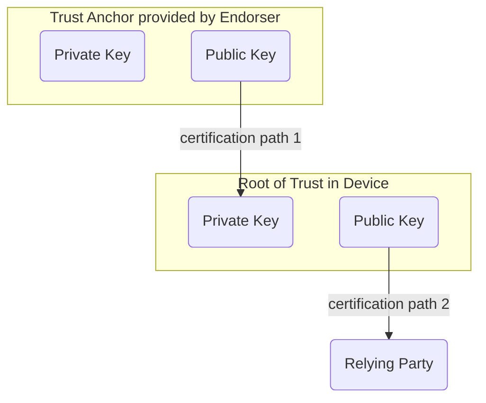
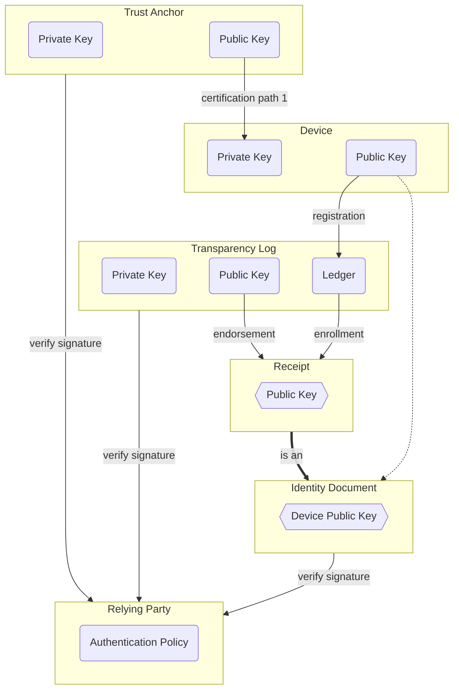

# Identity Documents as Receipts

The simplest form of identity document is a signed public key.

- unknown.

By proving possession of a private key, where the corresponding public key is signed in an identity document,
the identity associated with the public key can be authenticated.



Because keys need to be rotated to comply with best practices, 
one use case for SCITT is providing key transparency regarding public keys associated with software supply chains.



## Usage

You will need a CLI that can produce and consume SCITT transparent statements.
This one supports RFC9162 and json, and is 🚧 EXPERIMENTAL 🚧.

```sh
npm i -g @transmute/cli
```

Generates keys, signs them and produces receipts, roughly matching the diagrams above.

```sh
./script.sh
```

### Device Identity Document

A signed public key, with a receipt from a transparency service.

~~~~ cbor-diag
18(                                 / COSE Sign 1                   /
    [
      h'a4013822...31333337',       / Protected                     /
      {                             / Unprotected                   /
        -333: [                     / Receipts (1)                  /
          h'd2845867...cf71886e'    / Receipt 1                     /
        ]
      },
      nil,                          / Detached payload              /
      h'1c3271fb...b5df03d7'        / Signature                     /
    ]
)
~~~~

#### Protected Header

This is the protected header of the device's "Identity Document".

The device key is signed by the endorser before being made transparent.

~~~~ cbor-diag
{                                   / Protected                     /
  1: -35,                           / Algorithm                     /
  3: application/cose-key,          / Content type                  /
  4: h'5b55dd99...8a2acc6b',        / Key identifier                /
  13: {                             / CWT Claims                    /
    1: endorser.example,            / Issuer                        /
    2: device.example/devices/1337, / Subject                       /
  },
}
~~~~

#### Receipt

Proof that the identity document has been notarized.

~~~~ cbor-diag
18(                                 / COSE Sign 1                   /
    [
      h'a4013822...31333337',       / Protected                     /
      {                             / Unprotected                   /
        -222: {                     / Proofs                        /
          -1: [                     / Inclusion proofs (1)          /
            h'83030281...d0898dca', / Inclusion proof 1             /
          ]
        },
      },
      nil,                          / Detached payload              /
      h'7557d5c8...cf71886e'        / Signature                     /
    ]
)
~~~~

#### Protected Header

This is the protected header of the receipt for the device's "Identity Document".

Here we see the binary merkle tree from RFC9162 (-111: 1) is used, 
this is paired with the proofs in the unprotected header (-222: { -1 : [ ... ] }).

This tells us that the receipt is build on the inclusion proof from RFC9162.

~~~~ cbor-diag
{                                   / Protected                     /
  1: -35,                           / Algorithm                     /
  4: h'a04bfe57...296ea037',        / Key identifier                /
  -111: 1,                          / Verifiable Data Structure     /
  13: {                             / CWT Claims                    /
    1: transparent.notary.example,  / Issuer                        /
    2: device.example/devices/1337, / Subject                       /
  },
}
~~~~

#### Decoded Inclusion Proof

This proves inclusion of a merkle leaf constructed as described in RFC9162,
from a detached signature over a cose key (application/cose-key)

~~~~ cbor-diag
[                                   / Inclusion proof 1             /
  3,                                / Tree size                     /
  2,                                / Leaf index                    /
  [                                 / Inclusion hashes (1)          /
     h'a85b06ef...d0898dca'         / Intermediate hash 1           /
  ]
]
~~~~